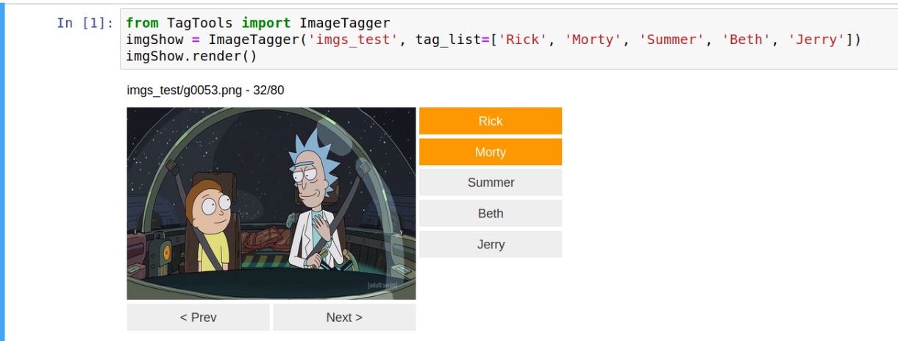
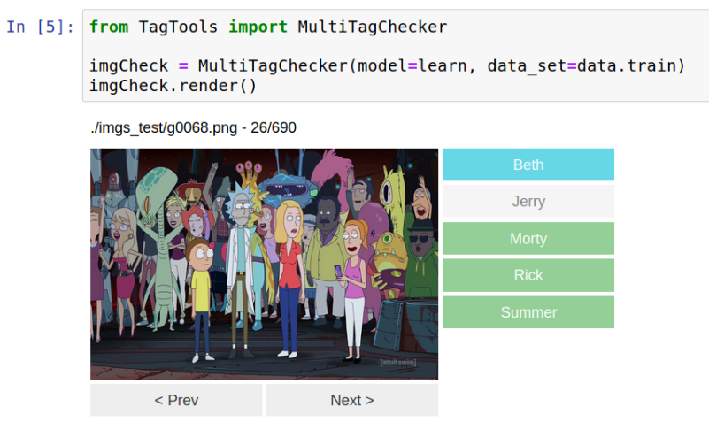

TagTools
================================================================================

This is a simple lib for ease the creation of data sets. 
The module here generated is conceived to personal use. Specifically it borns
during a `fastai` course for quick generation of datasets.

* `ImageTagger` is an object composed by ipywidgets. It let you choose wich
  tags appear on the image according to a list previosly provided.
  

* `MultiTagTester` is a similar interface object which allow you to check the
  prediccion of your model.
  

